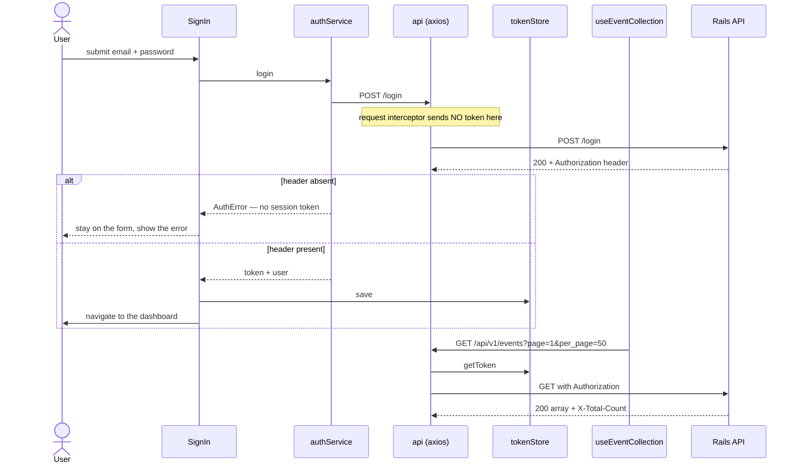
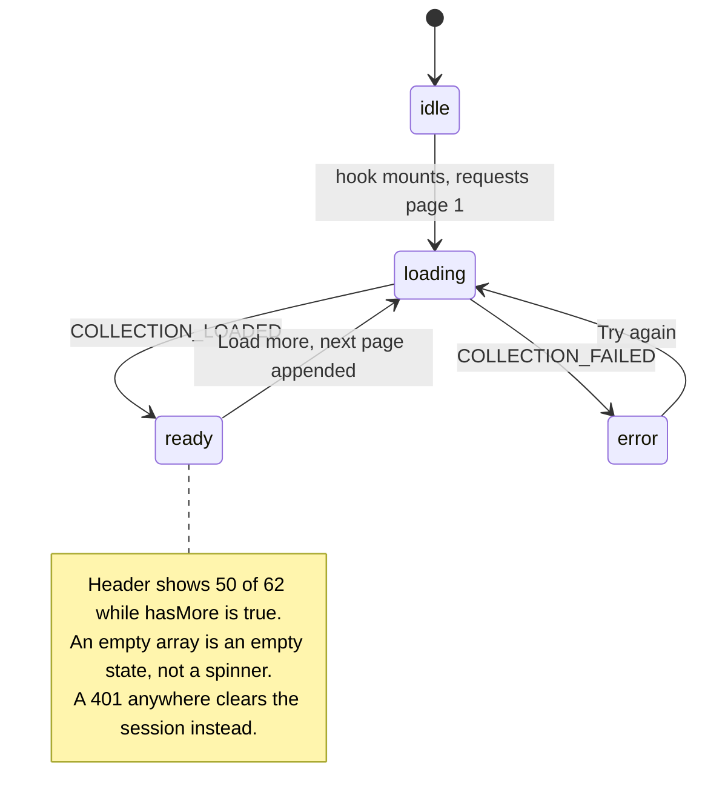

# Event Management — React client

A browser client for the `event_management_app_BE` Rails API. A signed-in user sees
three lists — events they organize, events they have booked, and upcoming events
someone else is running — and can create, edit, delete or join one.

No database here and nothing server-rendered: this repo is one bundle that talks to
eleven JSON endpoints and stores a bearer token. Almost every decision below follows
from one detail of that API — **the token arrives in a response header, not the body.**

## The six screens

Real renders at 1280×720, produced by `npm run screenshots` — Playwright drives the
production bundle against the in-repo mock API, so the data is the seed fixture, not
a mock-up. The "Load more (12 remaining)" button in the third shot is the whole
pagination story in one control.

|                                                                                                    |                                                                            |
| -------------------------------------------------------------------------------------------------- | -------------------------------------------------------------------------- |
| **The dashboard**<br>                               | **Events you organize**<br> |
| **A capped list, honest about the remainder**<br> | **Event detail**<br>  |
| **Creating an event**<br>                     | **Signing in**<br>              |

## Run it

Two terminals. No database, no Docker, no Rails.

```bash
npm install
npm run mock-api          # terminal 1 — stand-in API on :8681
npm start                 # terminal 2 — the app on :8680
```

Open <http://localhost:8680> and sign in as `ada@example.com`. The mock accepts any
non-empty password — it checks that the fields are present, nothing more.

Against the real Rails API instead:

```bash
API_PROXY_TARGET=http://localhost:3000 npm start
```

## The token never touches the body

`POST /login` answers `200` with the JWT in an `Authorization` **response header**,
already prefixed with `Bearer `. Three consequences are baked into
`src/services/api.js`: the value is replayed verbatim (adding a second `Bearer ` is
the classic bug), the interceptor deliberately skips `/login` and `/signup`, and a
cross-origin deployment is broken until the API sends
`Access-Control-Expose-Headers: Authorization` — because without it the browser
hides the header, the request still succeeds, and you get a logged-in-looking app
that 401s on everything.



`src/services/tokenStore.js` is the only module that touches `localStorage`, and it
is an interface — `getToken` / `getUser` / `save` / `clear` — with a
`localStorage` and an in-memory implementation. `createApiClient` and
`EventProvider` each take one by injection, which is what lets the test suite run the
**real** interceptors against an isolated session, and what a move to `HttpOnly`
cookies would replace.

## A list is a state machine, not an array

The API caps a list at 50 rows and reports the real size in `X-Total-Count`. A client
that renders `response.data` shows page one and quietly implies it is everything.
`parseListResponse` reads the headers instead and returns
`{items, page, perPage, total, hasMore}`; all three lists share one hook and one
component, so they cannot disagree.



Those four states are `EventSection.js`, written once: skeleton cards, an error with
a working retry, an honest empty message, or rows plus the remainder button. The
`append` flag on `COLLECTION_LOADED` is how "Load more" grows a list without
refetching page one — `eventReducer.test.js` pins it, along with the transition that
moves a joined event out of _joinable_ and into _joined_ in a single step. (The
screenshot's arithmetic: the seed fixture holds 62 joinable events, so a 50-row first
page leaves the 12 the button offers.)

## Which buttons appear, and why

The API is the authority — a cross-user `PATCH` or `DELETE` is `403`, and the policy
behind it refuses `join` to the event's own organizer. The UI mirrors that rather
than guessing:

- `isOrganizedBy(event, user)` compares `event.organizer_id` with the signed-in
  user's id and **fails closed** when either is missing. Edit and delete hang off
  that, not off which list drew the card. `EventCard.test.js` includes _"hides the
  controls when the identity is unknown, rather than assuming ownership"_.
- "Join event" is offered only on a card marked joinable that the user does not
  organize. If the server refuses anyway, `describeApiError` unwraps whichever
  envelope came back — `{errors: [...]}` for the `403`, `{attributes_errors: {...}}`
  for the duplicate-booking `422`, and Devise's bare `{status: [...]}` from
  `/signup` — and the message goes into a toast.
- `ProtectedRoute` renders a `<Navigate>` rather than calling `navigate()` from an
  effect, so an anonymous visitor fires **zero** API requests, per `App.test.js`.

There is **no capacity or waitlist anywhere in this client**, because the API has no
seat-count column. Nothing here can tell you an event is full.

## Settings

Create React App substitutes `REACT_APP_*` at **build** time, so changing one means
rebuilding, not restarting. Copy `.env.example` to `.env.local`.

| Name                 | Default                 | Purpose                                                                                               |
| -------------------- | ----------------------- | ----------------------------------------------------------------------------------------------------- |
| `REACT_APP_API_URL`  | `''` (same origin)      | Only needed for a cross-origin API, which then also needs CORS and the exposed `Authorization` header |
| `PORT`               | `8680`                  | Dev server. Not `3000` — that is the Rails API's                                                      |
| `API_PROXY_TARGET`   | `http://localhost:8681` | Where `src/setupProxy.js` forwards API calls in development                                           |
| `MOCK_API_PORT`      | `8681`                  | Port for `npm run mock-api`                                                                           |
| `SCREENSHOT_PORT`    | `8680`                  | Port `tools/serve-build.js` uses during a screenshot run                                              |
| `WEB_PORT`           | `8680`                  | Host port published by `docker-compose.yml`                                                           |
| `GENERATE_SOURCEMAP` | `true`                  | CRA flag. The Dockerfile sets it `false`                                                              |

## Commands

```bash
npm start            # dev server + API proxy
npm run test:ci      # the suite, once, non-interactive
npm run coverage     # …with a coverage report
npm run lint         # ESLint (react-app rules + Prettier, as errors)
npm run format:check # Prettier, read-only
npm run build        # production bundle into build/
npm run mock-api     # the stand-in API
npm run screenshots  # rebuild the images above (run `npm run build` first)
```

`npm run build` on the current tree produces an entry bundle of roughly **117 kB
gzipped**, plus a **47 kB** chunk holding the date-picker-heavy event form, which is
fetched only when the modal opens. `EventDetails` and `SignUp` are split out the same
way, since both are reached by a click.

A real curl transcript of the dev server — a sign-in returning the header, a 50-row
page declaring `x-total-count: 62`, a `404`, a cross-user `403`, a logout and a
tokenless `401` — is in
[`docs/captured/dev-session.txt`](docs/captured/dev-session.txt).

## Where the code lives

```
src/services/       nothing below this line imports React
  api.js            axios instance, the two interceptors, error envelopes
  tokenStore.js     the session seam (localStorage | memory)
  eventService.js   every endpoint, parseListResponse, isOrganizedBy
src/context/        EventContext provider + the pure eventReducer
src/hooks/          useEventCollection — loads and pages one collection
src/components/     EventSection (the four states), EventCard (ownership
                    gating), EventForm (lazy), ProtectedRoute, auth screens
src/layouts/Home.js the signed-in dashboard, three sections
src/testing/        test helpers and the shared seed fixture
tools/mock-api.js   stand-in API for dev, demo and screenshots
e2e/                Playwright screenshot capture
docker/nginx.conf   runtime server and reverse proxy
```

## What the tests hold down

`npm run test:ci` → **52 tests across 9 suites, all passing** (run on this tree).
Every test mocks at the axios adapter on the app's _own_ instance, so the real
request and response interceptors execute; nothing reaches the network and nothing
needs Rails.

Two test names carry their own history, which is worth more than a claim in prose:

- _"binds both inputs to state (regression: they were bound to `formData.email`,
  state was `formData.user.email`)"_ — the sign-in form's fields.
- _"renders the empty state for the API's `200 []` (it used to answer `204`)"_ — the
  list contract.

The rest: token attached verbatim and withheld from `/login`, the `401` sweep, all
three error envelopes, pagination parsing including the header-less fallback, the
reducer's transitions, ownership gating, the four list states, `404` versus `500` on
the detail page, and a full sign-in → dashboard → sign-out drive in `App.test.js`.

## Shipping it

```bash
docker compose build
docker compose --profile mock up     # app + the stand-in API
```

Multi-stage image (Node build → nginx runtime), unprivileged user, `HEALTHCHECK` on
`/healthz`, and an nginx config that serves the SPA and proxies the API so the
browser sees one origin.

**None of it has been run.** `docker compose config` parses cleanly and that is the
entire verification. This repo's own build report records, verbatim:

> - **Build verified: NOT RUN — deferred, Docker off**
> - **Boot verified: NOT RUN — deferred, Docker off**

## Known gaps

- **`public/_redirects` hard-codes the deployed API as a bare IP** (`18.189.139.245`).
  It is the original Netlify deployment's host, kept so that setup still works, and
  it must be changed before anyone deploys this anywhere else.
- **`tools/mock-api.js` is not Rails.** It reimplements the slice of the contract
  this client uses, in memory, with no real authentication — and it will not notice
  if the API changes. A contract test over shared fixtures would be the real fix.
- **Pagination is "load more", not deep paging.** No page numbers, no URL state, so a
  reload starts at page one. Deliberate for lists of tens of rows.
- **One stock photograph.** Cards are tinted deterministically from the event id so a
  grid is readable. There is no per-event image upload.
- **No capacity, and no way to add one from here.** See above.
- **CRA is the build tool**, with `react-scripts` at 5.0.1. It is unmaintained
  upstream; Vite is the honest next step and a bigger change than this repo has had.
