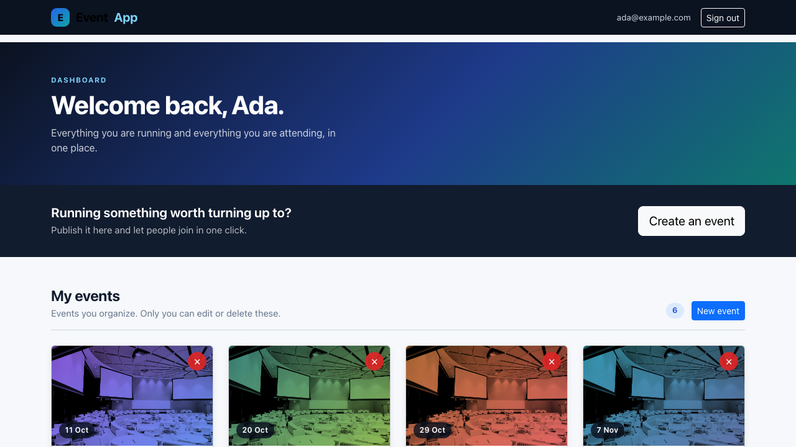
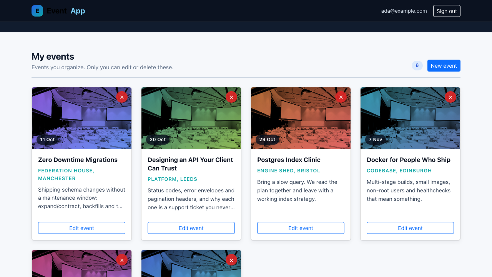
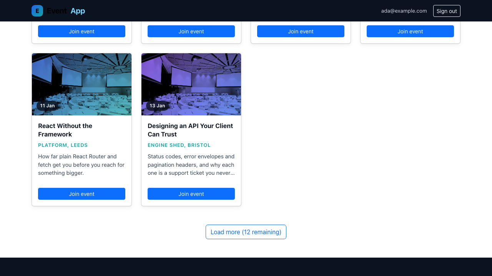
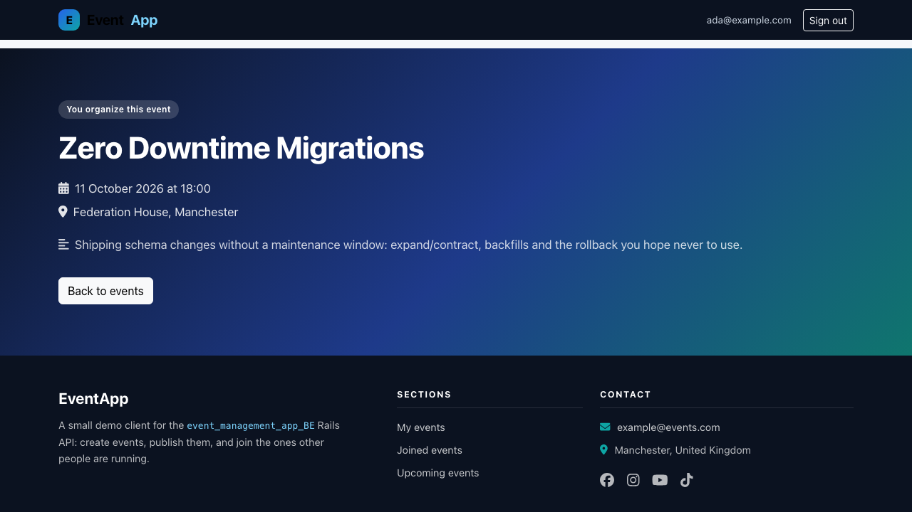
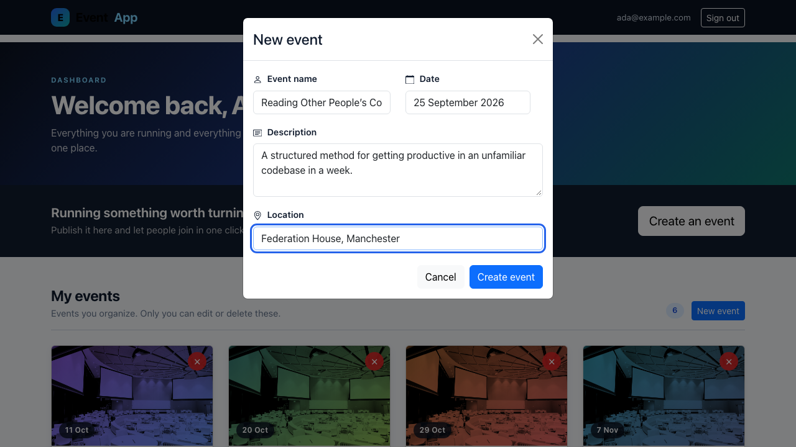
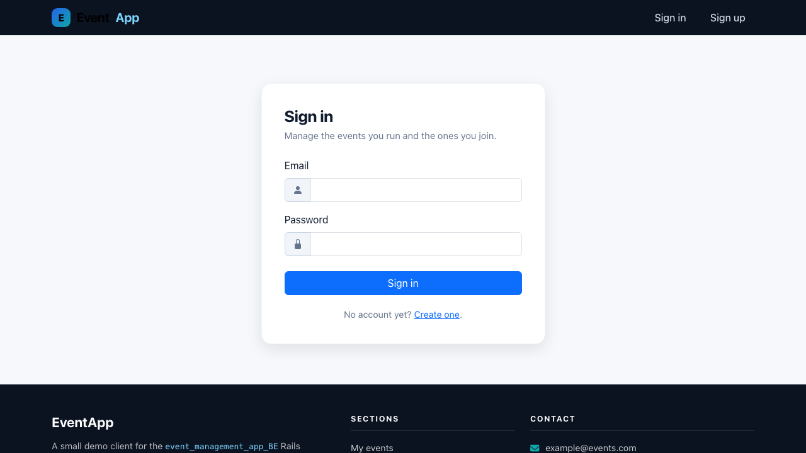
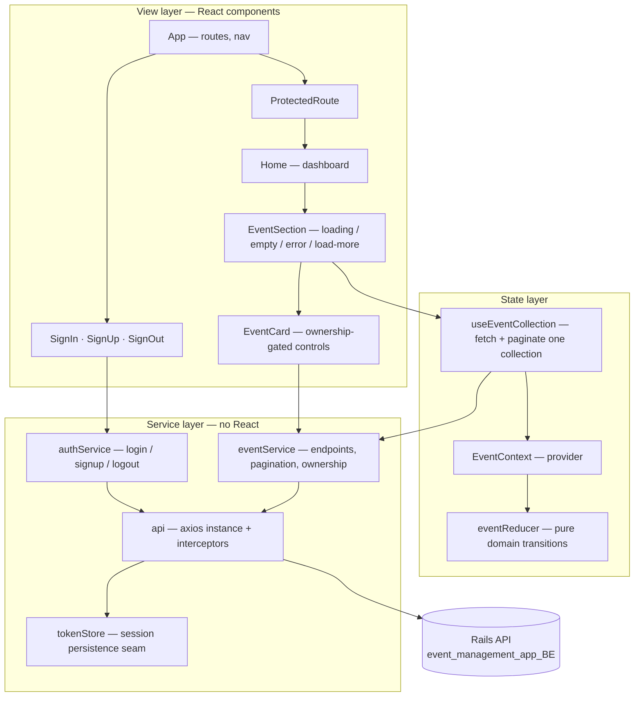
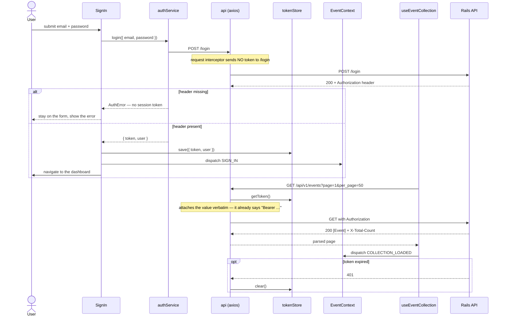

# Event Management — React client

A single-page React client for the [`event_management_app_BE`](../event_management_app_BE)
Rails API. A signed-in user can publish events they organize, browse upcoming
events other people are running, and join them. Authentication is a JWT issued
by the API in an `Authorization` response header.

This was written as a take-home exercise (the package was literally named
`react-test`), and it has been kept as one: the uplift covers architecture,
correctness, tests and documentation, and adds no new product features.

## Screenshots

Captured at 1440×900 by `npm run screenshots`, which builds the production
bundle, serves it, and drives it with Playwright against the mock API in
`tools/mock-api.js` — so every screen below is a real render of real data.

| The dashboard                                   | Events you organize                             |
| ----------------------------------------------- | ----------------------------------------------- |
|  |  |

| Paginated list, with the remaining count          | Event detail                                          |
| ------------------------------------------------- | ----------------------------------------------------- |
|  |  |

| Creating an event                                     | Signing in                                  |
| ----------------------------------------------------- | ------------------------------------------- |
|  |  |

## Architecture

Layered, with dependencies pointing inward. Components render and collect
input; they never construct a URL, read `localStorage`, or know that axios
exists. The service layer is plain JavaScript with no React import anywhere in
it, so it is unit-tested directly.



**The seam.** `tokenStore` is an interface, not a module of `localStorage`
calls: `createLocalStorageTokenStore`, `createMemoryTokenStore` and anything
else with the same four methods are interchangeable. `createApiClient` and
`EventProvider` both accept one. That is what lets the test suite run the real
axios interceptors against an isolated session, and what a move to `HttpOnly`
cookies would replace.

## Sign-in and the first protected call



## Quickstart

Two terminals, no database, no Docker:

```bash
npm install
npm run mock-api          # terminal 1 — a stand-in API on :8681
npm start                 # terminal 2 — the app on :8680
```

Open <http://localhost:8680>, sign in as `ada@example.com` with any password.

Against the real Rails API instead:

```bash
API_PROXY_TARGET=http://localhost:3000 npm start
```

## Configuration

Create React App substitutes `REACT_APP_*` variables **at build time**, not at
runtime; changing one requires a rebuild. Copy `.env.example` to `.env.local`.

| Name                 | Required | Default                       | Purpose                                                                                                                                                                                                                      |
| -------------------- | -------- | ----------------------------- | ---------------------------------------------------------------------------------------------------------------------------------------------------------------------------------------------------------------------------- |
| `REACT_APP_API_URL`  | no       | `''` (same origin)            | Origin of the Rails API. Leave empty when a reverse proxy forwards `/api`, `/login`, `/logout` and `/signup`; set it only for a cross-origin API, which then needs CORS plus `Access-Control-Expose-Headers: Authorization`. |
| `PORT`               | no       | `8680`                        | Port for the CRA dev server. Not `3000`, because that is the Rails API's default.                                                                                                                                            |
| `API_PROXY_TARGET`   | no       | `http://localhost:8681`       | Where `src/setupProxy.js` forwards API calls in development.                                                                                                                                                                 |
| `MOCK_API_PORT`      | no       | `8681`                        | Port for `npm run mock-api`.                                                                                                                                                                                                 |
| `SCREENSHOT_PORT`    | no       | `8680`                        | Port the production bundle is served on during a screenshot run.                                                                                                                                                             |
| `WEB_PORT`           | no       | `8680`                        | Host port published by `docker-compose.yml`.                                                                                                                                                                                 |
| `GENERATE_SOURCEMAP` | no       | `true` (`false` in the image) | Standard CRA flag; the Dockerfile disables source maps.                                                                                                                                                                      |

## Development

```bash
npm start            # dev server with the API proxy (PORT, API_PROXY_TARGET)
npm run test:ci      # the suite, once, non-interactive
npm test             # the suite in watch mode
npm run coverage     # the suite with a coverage report
npm run lint         # ESLint (react-app rules + Prettier, as errors)
npm run lint:fix     # …and fix what can be fixed
npm run format       # Prettier over src and the root config files
npm run build        # production bundle into build/
npm run mock-api     # the stand-in API, for running the UI without Rails
npm run screenshots  # rebuild the README screenshots (needs `npm run build` first)
```

A transcript of the dev server proxying a real sign-in, a paginated list, a
404, a cross-user `403` and a sign-out is in
[`docs/captured/dev-session.txt`](docs/captured/dev-session.txt) — produced by
curl against the running app, not written by hand.

### Docker

```bash
docker compose build
docker compose --profile mock up      # app + the stand-in API
```

The image is multi-stage (Node build → nginx runtime), runs as an unprivileged
user, and has a `HEALTHCHECK` against `/healthz`. `docker/nginx.conf` serves the
SPA and proxies the API paths, so the browser sees a single origin.

**Not verified.** These files parse (`docker compose config` is clean) but have
never been built or booted — Docker was switched off in the environment where
they were written.

## Project structure

```
src/
  services/               no React below this line
    api.js                axios instance; attaches the token, handles 401
    tokenStore.js         session persistence seam (localStorage | memory)
    authService.js        login / signUp / logout
    eventService.js       every events endpoint, pagination parsing, ownership
  context/
    eventReducer.js       pure domain reducer — the cross-collection rules
    EventContext.js       provider; reads the persisted session exactly once
  hooks/
    useEventCollection.js loads and pages one collection into the context
  components/
    EventSection.js       the four states a remote list can be in
    EventCard.js          one event; controls gated on organizer_id
    EventForm.js          create / edit (lazy-loaded via LazyEventForm.js)
    ProtectedRoute.js     redirects before a guarded screen can mount
    …
  layouts/Home.js         the signed-in dashboard
  utils/                  date formatting, per-event colour
  testing/                test-only helpers and the shared seed fixture
  setupProxy.js           dev-server proxy to the API
tools/
  mock-api.js             stand-in for the Rails API (dev/demo/screenshots only)
  serve-build.js          serves build/ + proxies the API, for screenshots
  optimise-screenshots.js lossless PNG re-deflate
e2e/                      Playwright screenshot capture
docker/nginx.conf         runtime server and reverse proxy
docs/screenshots/         the images referenced above
docs/captured/            the curl transcript quoted above
```

## Design notes

**Business logic is out of the components.** Every screen used to hold its own
`useState` + `useEffect` + `axios.get(...)` block and render `response.data`
directly. Three copies of the same code meant three places for a contract change
to be missed — which is exactly what happened when the API added pagination.
The HTTP calls now live in `services/`, the loading/paging state in one hook,
and the domain transitions in one pure reducer.

**Ownership is read from the data, not inferred from context.** An "Edit"
button used to appear on a card because of which list it was rendered in. The
API now returns `403` for a cross-user update or delete, so guessing would mean
offering a button that cannot work. `isOrganizedBy(event, user)` compares
`event.organizer_id` with the signed-in user's id and fails closed when either
is unknown.

**Pagination is the real bottleneck, and it is a correctness bug as much as a
performance one.** The API caps list responses at 50 rows and reports the true
size in `X-Total-Count`. A client that renders `response.data` shows the first
page and silently claims it is everything. `parseListResponse` reads the
headers, the section header shows `50 of 62`, and "Load more" fetches page 2 and
appends — so the UI is honest about the window it is showing, and the request
stays bounded.

**Bundle size is the other one.** Splitting the two click-reached routes
(`EventDetails`, `SignUp`) and the date-picker-heavy `EventForm` into their own
chunks moved the entry bundle from **160.41 kB to 116.73 kB gzipped (−27%)**,
measured by `react-scripts build` before and after. The form's 47 kB chunk is
fetched when a modal opens, which is the first moment it can possibly be needed.

**One session, one owner.** `localStorage` was previously read from the reducer's
initial state, from the axios interceptor and from the sign-out handler. Those
three could disagree — and did, on a failed logout, which left the UI signed in
with a revoked token. The `tokenStore` interface is now the only reader and
writer, the provider consults it once at startup, and sign-out clears it whether
or not the server accepted the revocation.

**Guard at the router, not in an effect.** `App` used to call `navigate('/login')`
from a `useEffect`, which runs _after_ the protected screen has mounted and
fired its requests. `ProtectedRoute` renders a `<Navigate>` instead, so an
anonymous visitor makes zero API calls — asserted in `src/App.test.js`.

## Testing

52 tests across 9 suites, all with the network mocked at the axios adapter so
the real request and response interceptors are exercised:

- `services/` — token attachment (and its absence on `/login`), 401 handling,
  both API error envelopes, pagination parsing, ownership.
- `context/eventReducer.test.js` — the domain transitions, including joining an
  event moving it between two collections.
- `components/` — the sign-in binding, a rejected login, a tokenless `200`,
  ownership-gated controls, the four list states, and 404 versus 500 on the
  detail page.
- `App.test.js` — sign in, load the dashboard, assert every protected request
  carried the bearer token, sign out, and land back on the form.

No test makes a network call, and no test needs the Rails API running.

## Limitations

- **No `npm run start` without an API.** The app is a pure client. Use
  `npm run mock-api` or point `API_PROXY_TARGET` at a real backend.
- **`tools/mock-api.js` is not the Rails app.** It implements the slice of the
  contract this client uses, including the status codes that matter, but it has
  no database, no real authentication (any password works) and no validation
  beyond a couple of illustrative cases.
- **The Docker image has never been built or booted.** See above.
- **Pagination is "load more", not deep paging.** There is no page-number UI and
  no URL state, so a reload returns to page 1. That is a deliberate fit to a
  dashboard of tens of rows, not thousands.
- **One stock photograph.** Cards are tinted from a fixed palette keyed on the
  event id to make a grid readable; there is no per-event image upload.
- **`public/_redirects` hard-codes the deployed API host** as a bare IP address.
  It is the original deployment's, kept so the Netlify setup still works, and it
  must be changed before anyone deploys this elsewhere.
- **Build tooling was upgraded.** `react-scripts` moved from 3.4.4 to 5.0.1
  because the original could not build on any Node ≥ 17 (`ERR_OSSL_EVP_UNSUPPORTED`,
  webpack 4). React itself is unchanged at 18.
